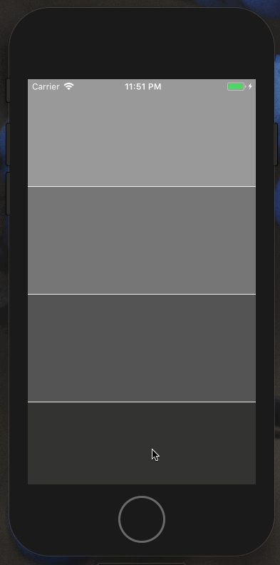

Time and time again I find myself fighting a ScrollView to get it to work the way I want it to. Is it flex? Is it the ScrollView? It was time I wrote an article.

My favorite scenario, the one that inspired this article, the one that I *always* forget about, the one I recently encountered for [Orchard](https://www.orchard.ai), (what a build-up) is one where I’d like the screen to scroll normally when things don’t fit and `justify-content: space-between` when there’s room.

#### A couple of different solutions came to mind at first:

- Use either `View` or `ScrollView` depending on the device height (meh)
- Decrease the text size until everything fit (meh)
- Place the “Privacy Policy” outside of the `ScrollView` making it sticky, but it felt weird to scroll over and still see the privacy policy.

I felt like these options would either make my life miserable or even worse: the user’s life miserable. I went to the docs for `ScrollView` and read over [`contentContainerStyle`](https://facebook.github.io/react-native/docs/scrollview.html#contentcontainerstyle):

> These styles will be applied to the scroll view content container which wraps all of the child views

contentContainerStyle is a step in the right direction. It will apply styles to the content container as if there were a `View` wrapping your children.

It worked great on the iPhone X. There was enough room so everything was justified vertically. But what happens when you try this on a smaller device like the iPhone 5s? It sticks! Why?

#### React Native Flex vs. CSS Flex

It turns out that `flex` [functions a bit differently](https://facebook.github.io/react-native/docs/layout-props.html#flex) in React Native than it does in CSS which is why setting `flex: 1` didn’t work the way I thought it would.

In CSS, `flex` is short-hand for controlling the following properties:

- `flex-grow`
- `flex-shrink`
- `flex-basis`

Writing `flex: 1` in CSS is shorthand for:

- `flex-grow: 1`
- `flex-shrink: 1`
- `flex-basis: 0`

In React Native, on the other hand, `flex` consumes a number, not an string and it works like this:

- positive number — component becomes flexible and will function proportionally to its value. A value of 2 will take up twice as much space as a sibling that has a value of 1.
- 0 — the component isn’t flexible and is sized by `width` and `height` .
- -1 — the component is sized by its `width` and `height` but if there’s not enough space, it will shrink to satisfy `minWidth` and `minHeight` .

#### Flex Grow

Writing `flex-grow: 1` in CSS is shorthand for:

- `flex-grow: 1`
- `flex-shrink: 1`
- `flex-basis: auto` (this is different!)

`flex-grow` distributes **free space** to `flex` items. When there is no free space, `flex-grow` does nothing and `flex-shrink` takes over to determine how much items will shrink relative to its siblings (instead of grow).

#### Why does this matter?

The solution has to do with the implementation differences of `flex` and `flexGrow` in React Native.

Since `flexGrow` functions the same way, we can easily solve this problem by updating our `contentContainerStyle` to `flexGrow: 1` instead:

Using `flexGrow` vs. `flex` in `contentContainerStyle` prop

Hopefully neither of us will have to struggle with a `ScrollView` and `flex` again!

