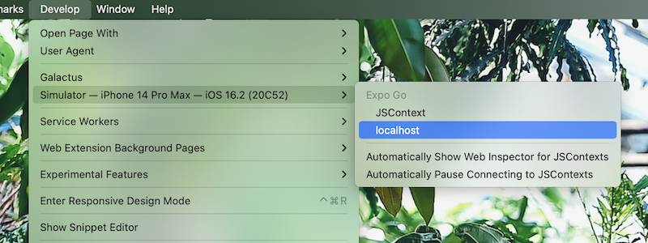
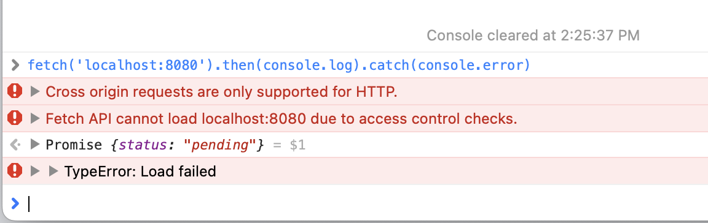

I recently struggled with fixing an cryptic error message: `TypeError: Load Failed` in my React Native app.

I'm running a service worker within a WebView. On iOS, that service worker runs in Safari. Safari has various issues and this is one of them.

`TypeError: Load Failed` might end up being a different issue for you, but for me it was a CORS related issue.

Here's how I figured that out:

- Opened Simulator running my app
- Opened Safari
- Top bar: Develop Menu
- Select Simulator
- Select localhost

You might see some console.log's here. I also took the request I was running and copied it directly into Safari's console to see if I could recreate it.

Sure enough, I had a much better CORS-related error message.
