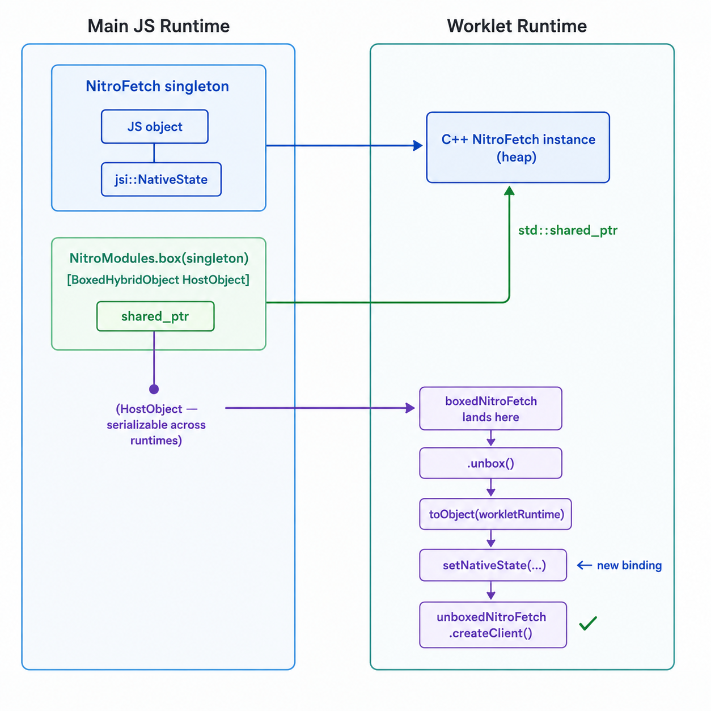

I was reading through the source of [react-native-nitro-fetch](https://github.com/peterpme/react-native-nitro-fetch) and hit this inside `nitroFetchOnWorklet`:

```ts
return await runOnRuntimeAsync(rt, () => {
  'worklet';
  const unboxedNitroFetch = boxedNitroFetch.unbox();
  const unboxedClient = unboxedNitroFetch.createClient();
  const request = buildNitroRequestPure(input, init);
  const res = unboxedClient.requestSync(request);
  // ...
});
```

And up at the top of the module:

```ts
export const boxedNitroFetch = NitroModules.box(NitroFetch);
```

I had no idea what `box` and `unbox` were. They sound like they should be obvious but nothing clicked. Here's what they actually are, from the source up.

## Where setNativeState comes from

Before getting into box and unbox, it helps to know where `setNativeState` actually comes from, because it's the root of the whole problem.

It came from Hermes. The Facebook team designed it there first, then it got standardized into JSI, the engine-agnostic C++ interface that sits between React Native and any JS engine. JSI is what lets React Native swap between Hermes and JSC without rewriting every native module. So `setNativeState` lives in React Native core, but Hermes invented it.

JSC didn't support it until late 2023. Before that, the JSC implementation literally threw `std::logic_error("Not implemented")` if you tried to call it. Third-party library authors were hitting 2-4x performance regressions because they had to fall back to the slower `HostObject` approach on JSC. React Native's own internals didn't roll it out internally until October 2023.

Nitro uses `NativeState` as the foundation for `HybridObject`. It didn't create the API, it just went all-in on it early.

## What a HybridObject is made of

A Nitro `HybridObject` is a C++ object exposed to JavaScript through JSI. In JSI, it's represented as two things glued together:

1. A **prototype chain**: the JS methods like `createClient`, `requestSync`, etc.
2. A **`jsi::NativeState`** pointer: the actual C++ instance, attached directly to the JS object

You can see this in `HybridObject.cpp`:

```cpp
jsi::Value HybridObject::toObject(jsi::Runtime& runtime) {
  // Get the object's base prototype (global & shared)
  jsi::Value prototype = getPrototype(runtime);

  // Create the object using Object.create(...)
  jsi::Object object = CommonGlobals::Object::create(runtime, prototype);

  // Assign NativeState to the object so the prototype can resolve the native methods
  object.setNativeState(runtime, shared());

  return object;
}
```

`setNativeState` attaches a C++ pointer to a JS object. When JS calls a method on that object, JSI looks up the `NativeState` pointer and dispatches the call to the right C++ method. It's clean, fast, and type-safe.

But it has one critical constraint: that `NativeState` is bound to the specific `jsi::Runtime` that created it. It is not portable.

## The worklet runtime problem

`createWorkletRuntime` from `react-native-worklets` spins up a completely separate JS engine instance. Its own `jsi::Runtime`, its own heap, its own global object. When you call `runOnRuntimeAsync(rt, () => { 'worklet'; ... })`, that closure executes in a different engine than the one your React app runs in. They're isolated.

If you try to close over a `HybridObject` directly in a worklet closure, the worklets library has to serialize it and copy it from the main runtime into the worklet runtime. But it doesn't know how to handle `jsi::NativeState`. The `HybridObject` has a custom prototype chain and a native state pointer that is meaningless in another engine's address space. The library either drops it silently or crashes.

So you can't just do this:

```ts
// This doesn't work
const myFetch = NitroFetchSingleton;

runOnRuntimeAsync(rt, () => {
  'worklet';
  myFetch.createClient(); // myFetch's NativeState belongs to the main runtime
});
```

## What box() actually does

`NitroModules.box()` converts a `HybridObject` from the newer `jsi::NativeState` representation into an older, simpler one: a `jsi::HostObject`.

`HostObject` is JSI's original escape hatch for native interop. You implement a `get()` method in C++, and JSI calls it whenever JavaScript accesses a property. `HostObject` does not use `NativeState`. It's a plain C++ virtual interface that the worklet serializer already knows how to move across runtimes.

Here's the entire `BoxedHybridObject` class from Nitro's source:

```cpp
class BoxedHybridObject final : public jsi::HostObject {
public:
  explicit BoxedHybridObject(const std::shared_ptr<HybridObject>& hybridObject)
    : _hybridObject(hybridObject) {}

public:
  jsi::Value get(jsi::Runtime& runtime, const jsi::PropNameID& propName) override;
  std::vector<jsi::PropNameID> getPropertyNames(jsi::Runtime& runtime) override;

private:
  std::shared_ptr<HybridObject> _hybridObject;
};
```

That's it. A thin wrapper holding a `std::shared_ptr` to the real C++ object. The `shared_ptr` is plain heap memory. It has nothing to do with any JS runtime. It's a reference-counted pointer that lives in C++ land, not in JSI land.

And `unbox` is the only property exposed:

```cpp
jsi::Value BoxedHybridObject::get(jsi::Runtime& runtime, const jsi::PropNameID& propName) {
  if (jsi::PropNameID::compare(runtime, propName, PropNameIDCache::get(runtime, "unbox"))) {
    return jsi::Function::createFromHostFunction(
        runtime, PropNameIDCache::get(runtime, "unbox"), 0,
        [hybridObject = _hybridObject](jsi::Runtime& runtime, ...) -> jsi::Value {
          return hybridObject->toObject(runtime);
        });
  }
  return jsi::Value::undefined();
}
```

When `.unbox()` is called, it calls `hybridObject->toObject(runtime)`, passing in the new runtime. That's the same `toObject` from earlier, which calls `setNativeState` on the current runtime. The result is a fully wired `HybridObject` rooted in the worklet runtime, backed by the same C++ instance.

`box` and `unbox` were added to Nitro in a single commit in September 2024, titled explicitly: "Add NitroModules.box(...) to support using Nitro Modules from any Runtime/Worklets context." Worklets were the entire reason it was built.

## The full flow



The C++ object is never copied. The `shared_ptr` just gets a new JS wrapper pointing at it, created fresh in the worklet runtime.

## Why this also needs buildNitroRequestPure

There's a second wrinkle: worklets have a restricted JS environment. `instanceof` doesn't work across runtimes. The `Headers` class from the main runtime doesn't exist in the worklet. No `Blob`, no `FormData`, no async APIs.

So `buildNitroRequestPure` (note the `Pure` suffix) is a worklet-safe version of the normal request builder. It avoids `instanceof` in favor of `Object.prototype.toString.call()`, uses `Object.keys()` instead of `Object.entries()`, and throws explicitly if you pass a body type it can't handle synchronously:

```ts
function buildNitroRequestPure(input, init) {
  'worklet';
  // uses Object.prototype.toString.call() not instanceof
  // uses Object.keys() not Object.entries()
  // throws on FormData/Blob, no async resolution in worklets
}
```

The `'worklet'` directive tells the worklet compiler to bundle this function into the worklet runtime's code. Functions without it can't be called from a worklet closure.

## Is this still necessary?

This is where it gets interesting, because nitro-fetch is not an old codebase. It's on nitro-modules `0.35.2` and worklets `0.8.1`, both from early 2026. At those versions, `installWorkletsSupport()` is called automatically when `react-native-nitro-modules` is imported, and worklets 0.8.x ships `registerCustomSerializable`. The automation infrastructure is fully in place.

Yet the manual `box`/`unbox` is still there. The reason is subtle.

`nitroFetchOnWorklet` doesn't run on the standard UI worklet context. It spins up its own named background runtime:

```ts
nitroRuntime = createWorkletRuntime('nitro-fetch')
```

`installWorkletsSupport()` registers the custom serializable at import time, before this runtime is created. Whether that registration propagates to a runtime that didn't exist yet isn't guaranteed. Beyond that, `boxedNitroFetch` is a module-level constant accessed by name inside the worklet closure. Relying on the auto-serializer to correctly handle it in a dynamically-created named runtime is a bet the author chose not to make.

Manual boxing is explicit and guaranteed to work regardless. The `shared_ptr` inside `BoxedHybridObject` is just C++ heap memory. It doesn't care about runtime registration, timing, or which runtime was created when.

So the answer is: the automation exists, but this code has a good reason to stay explicit.

For the standard case — closing over a `HybridObject` in a regular `runOnUI` worklet — you shouldn't need `box`/`unbox` by hand on current versions. Nitro's original docs for that September 2024 commit said:

> "In future versions of react-native-worklets-core or react-native-reanimated we expect fully automatic jsi::NativeState support, which will make boxing obsolete."

That future mostly arrived. The mechanism is the same `HostObject` wrapper and `shared_ptr` trick either way. It's just getting automated for the common path.

## The timeline

- **Hermes ~2021**: `NativeState` is invented in Hermes
- **JSC late 2023**: JSC finally implements `setNativeState` (it was throwing "Not implemented" before this)
- **October 2023**: React Native rolls out `NativeState` in its own internals
- **September 2024**: Nitro adds `box`/`unbox` as a manual worklet workaround
- **Worklets 0.7.1, early 2025**: `registerCustomSerializable` lands, worklets get a hook for custom types
- **Nitro 0.33.2, January 2026**: Nitro uses that hook, `HybridObjects` now auto-serialize without manual boxing
- **Future**: full native `NativeState` support in worklets makes the whole thing transparent

The `HostObject` is the passport. The `shared_ptr` is the actual traveler.
