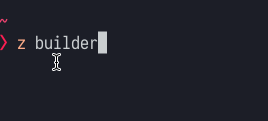

We've been using `nvm`, `n` and maybe even `homebrew` for years to manage our Node.js version. They have been _good enough_ until now. [fnm](https://github.com/Schniz/fnm) stands for "Fast Node Manager".

It's written in [ReasonML](https://reasonml.org) and has literally instant startup times:




## Features:

- Single file, easy installation, instant startup
- Built with speed in mind (seriously)
- Works with `.nvmrc` and `.node-version` files (compatible with your current tooling)

## Installation:

```zsh
brew install Schniz/tap/fnm
```

## Configuration:

After you've installed it, you have to add `fnm` to your path. I use `zsh` so this is what I have in my `.zshrc` file:

```zsh
eval "$(fnm env --multi --use-on-cd)"
```

### Breakdown

`--multi` - will allow you to use a different Node version per shell. This means if you open a new terminal window and change the version number, it won't be linked to the old one (this is what you want!)

`--use-on-cd` - will automatically switch the node version based on your `.nvmrc` file. You might have had this off if you've used `nvm` in the past, but its blazing :fire: fast, it's worth keeping it on by default

[Learn more on Github](https://github.com/Schniz/fnm)
