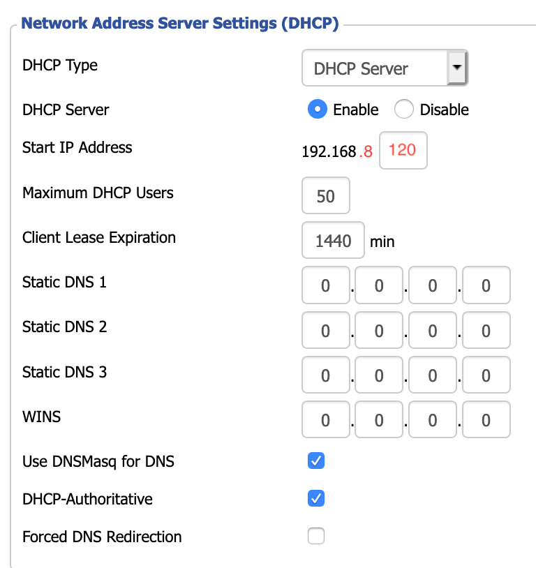
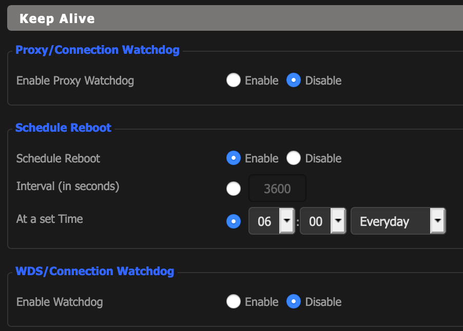

I recently upgraded my TP-Link Archer c9 version 1 router to use dd-wrt. It's powerful as it is but the additional settings I can add are fantastic.

Navigate to your router default homepage
[http://192.168.1.1/](http://192.168.1.1/)

- Change Password

## Setup Tab

Assume if a field isn't listed, you don't have to change it!

### Optional Settings

- Router Name
    - Change to whatever you'd like


### Router IP

- Local IP Address: Change this! This'll help prevent malware from spreading:
    - 192.168.7.4 or 192.168.3.6 - just don't keep it the default 192.168.1.1


### Network Settings

- Make sure DNSMasq for DNS and DHCP-Authoritive are checked



### Time Settings

- Time zone - check the right timezone

**Click Save, then Apply Settings**

- Open up your computer's Network Settings (System Prefs → Network)
- Ethernet / WiFi click "Advanced"
- Click RENEW DHCP Lease
- You can also toggle your WiFI on/off or unplug your ethernet cable back in

Go back to 

# Basic Wireless Settings


## Wireless Security


## Security

** I have WAN requests ping enabled for line quality tests on dsl reports


## Adminstration Keep Alive




## Commands

In startup script, I have these 3 settings. This is the "Transmit Queue Length". I have a very small length set from the traditional 1500 to help improve ping times.

```
ifconfig eth0 txqueuelen 2
ifconfig eth1 txqueuelen 2
sleep 10
```

## Pi-hole settings

Pi-hole is a network adblocker that runs on the raspberry pi:

These settings live under Services > DNSMasq.

```sh
dhcp-option=6,192.168.XXX.XXX
domain-needed
bogus-priv
no-resolv
server=192.168.XXX.XXX
expand-hosts
```

## Resources

- [ftp://ftp.dd-wrt.com/betas/2020/](ftp://ftp.dd-wrt.com/betas/2020/)
- [https://wiki.dd-wrt.com/wiki/index.php/Installation](https://wiki.dd-wrt.com/wiki/index.php/Installation)
- [https://dfarq.homeip.net/recommended-dd-wrt-settings/](https://dfarq.homeip.net/recommended-dd-wrt-settings/)
- [https://wiki.dd-wrt.com/wiki/index.php/Basic_Wireless_Settings](https://wiki.dd-wrt.com/wiki/index.php/Basic_Wireless_Settings)
- [https://www.reddit.com/r/DestinyTheGame/comments/5zxaw0/reduce_lag_in_pvpimprove_your_connection_indepth/](https://www.reddit.com/r/DestinyTheGame/comments/5zxaw0/reduce_lag_in_pvpimprove_your_connection_indepth/)
- [https://www.reddit.com/r/pihole/comments/er1opk/pihole_ddwrt_dns_redirection_issues/](https://www.reddit.com/r/pihole/comments/er1opk/pihole_ddwrt_dns_redirection_issues/)
- Archer C9v1 dd-wrt beta [ftp://ftp.dd-wrt.com/betas/2020/04-15-2020-r42910/tplink_archer-c9v1/](ftp://ftp.dd-wrt.com/betas/2020/04-15-2020-r42910/tplink_archer-c9v1/)
