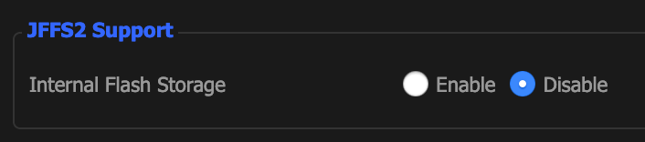

[NextDNS](https://nextdns.io) is the privacy-enabled tool you've been waiting for. It's like Pi-hole but runs in the cloud. 

Right now it's free, but once they leave beta they plan to charge a couple bucks a month. **Worth. every. penny.**

NextDNS will encrypt your DNS, block ads, bypass censorship, protect your privacy and offer parental controls.

NextDNS will also protect you from everything like Cryptojacking, threat intelligence, crazy algorithms, NSA spying, wide spectrum trackers (like wtf!) and much more

*Finally* you can use NextDNS like a Pi-hole in the cloud and block any list of websites, including lists like [Steven Black's Host Files](https://github.com/StevenBlack/hosts).

# Running NextDNS via Apps

You can run NextDNS on every device individually. Download the specific app, enter your configuration id, done!

- [Google Play Store](https://play.google.com/store/apps/details?id=io.nextdns.NextDNS)
- [iOS](https://apps.apple.com/app/nextdns/id1463342498)
- [Windows](https://nextdns.io/download/windows/stable)
- [Mac App Store](https://apps.apple.com/app/nextdns/id1464122853)
- [Linux](https://github.com/nextdns/nextdns/wiki)
- [Chrome OS](https://chrome.google.com/webstore/detail/nextdns/pkdcfcnohogmdmhllilgaheobbjadggl)

Make sure you're running an up to date DD-WRT version. Most routers support the latest updates.

# Running NextDNS directly on your Router

The nice part about this is that you don't have to install any apps. The tricky part is, depending on the router/software you have, this can turn into a shitshow.

You can see if your router supports one-click install [here](https://github.com/nextdns/nextdns/wiki).
A lot of your favorite routers are supported:

- OpenWRT
- Merlin (Asus)
- Ubiquiti EdgeOS / USG
- Synology
- VyOS

Since I run dd-wrt, it's a bit more complex:

# Warning - This Shit Is Complex And You Might Brick Your Router

Don't blame me for it, every router config is different. YMMV, etc. Make sure you back it up and whatever.

## Enabling JFFS if you don't have it enabled

[https://wiki.dd-wrt.com/wiki/index.php/JFFS#Enable_JFFS:_Create_.2Fjffs](https://wiki.dd-wrt.com/wiki/index.php/JFFS#Enable_JFFS:_Create_.2Fjffs)

- Click Administration Tab
- Scroll down to JFFS2 Support. It's probably disabled. Click Enable

    

- Save. Wait a few seconds. Then, click Apply Settings.
- Go back to JFFS2 Support. Click "Enable" on Clean Internal Flash Storage. Don't click Save, just Apply Settings.

    

- Once the settings are applied, turn off Clean Internal Flash Storage and Click Save

    

- Reboot your router!

## Installing Entware on DD-WRT

[https://wiki.dd-wrt.com/wiki/index.php/Installing_Entware](https://wiki.dd-wrt.com/wiki/index.php/Installing_Entware)

It sounds like a PITA but it really isn't bad. You need a USB stick.

- You need e2fsprogs to convert to e2f fiesystem that's supported by your router: 
`brew install e2fsprogs`
- `sudo $(brew --prefix e2fsprogs)/sbin/mkfs.ext2 -L opt /dev/disk2s1` Run diskutil list to see the right disk
- mkfs.ext2 for USB dis, mkfs.ext3 for hard drive
- If you get a "resource busy" command then run `diskutil unmount disk3` (again, find disk with diskutil list)
- Once that's done, plug it into your router
- Go to DD-WRT Admin, find Services USB and turn on: Core USB Support, USB Storage and Automatic Drive Mount are all enabled
- Reboot your router
- Download Entware
- Go here and under "Installation" figure out your router type. It's probably ARM7 but make sure !!! [https://wiki.dd-wrt.com/wiki/index.php/Installing_Entware](https://wiki.dd-wrt.com/wiki/index.php/Installing_Entware)

```bash
mkdir /opt/jffs
mount -n --bind /opt/jffs /jffs
```

cd into `/opt/jffs` 

## Install NextDNS

Whew, we're finally here!

```bash
sh -c "$(printf "GET /install HTTP/1.0\nHost: nextdns.io\n\n" |
    openssl s_client -quiet -connect "nextdns.io:443" 2>/dev/null |
    sed -n '/^\r/,$p' | sed 1d)"
```

## Restart your Router

# Closing Thoughts

DD-WRT support is finnicky right now, but the NextDNS team is actively working on making it a one-click installation.
