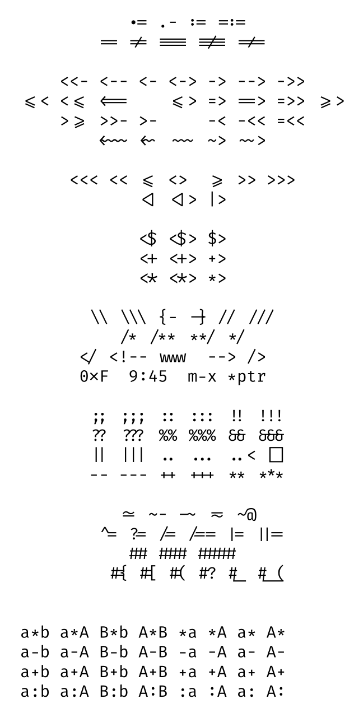

If Operator Mono and Fira Code spent a lot of time together and had a baby, you’d get something that looks like this:

Ligatures & italics working in harmony. See the !== and the arrow function?

Operator Mono is cool and all, but quite frankly after seeing Fira Code’s ligatures, I had a tough time choosing between the two. So I made them work together.

If you’re not sure what I’m talking about, check out the graphic below. Yes, it’s frickin’ sweet.

All you have to do to get this working is:

- [Download Fira Code](https://github.com/tonsky/FiraCode#download-fira-code-v1102--follow-updates--firacode)
- [Purchase & Download Operator Mono (get your co to buy it)](http://www.typography.com/blog/introducing-operator)
- Delete the “fonts” package if you’re using it. AFAIK it’ll screw things up.
- Open up Atom’s stylesheet and paste below. (Atom -> Stylesheet)

