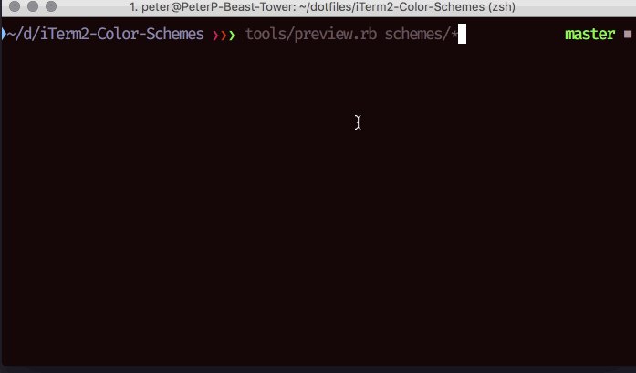

I was perusing [https://github.com/mbadolato/iTerm2-Color-Schemes#previewing-color-schemes](https://github.com/mbadolato/iTerm2-Color-Schemes#previewing-color-schemes) when all the way at the bottom, I noticed a simple tool that lets you preview themes without having to import them first!

From within the iTerm2-Color-Schemes directory, type one of the following:

1. Apply AdventureTime scheme to the current session

```sh
tools/preview.rb schemes/AdventureTime.itermcolors
```

2. Apply the schemes in turn.
3. Press any key to advance; hit CTRL-C or ESC to stop

#### Preview all the themes at the same time:

```sh
tools/preview.rb schemes/*
```


Theme Preview 🔥

I’ve been using this library for years never scrolling down far enough. Hopefully I’m not the only one who hasn’t done that 😂

